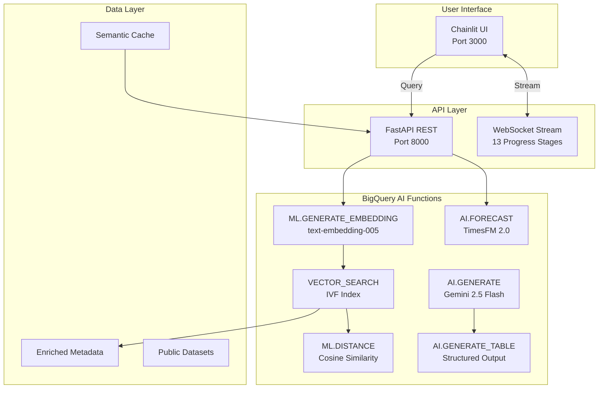

# BQ Flow

> **Natural Language to Predictive Insights powered by BigQuery's cutting-edge AI capabilities**

<div align="center">

[](https://cloud.google.com/bigquery)
[](https://ai.google.dev)
[](https://github.com/google-research/timesfm)
[](https://python.org)

**[Live Demo](#demo) • [Features](#features) • [Architecture](#architecture) • [Setup](#setup) • [Usage](#usage)**

</div>

**BQ Flow** transforms BigQuery from a data warehouse into an AI-powered analytics engine that understands natural language, discovers semantic relationships, and generates predictive insights—all without moving data or managing external ML infrastructure.

### 🎯 Hackathon Approaches Implemented

#### **The AI Architect** 🧠
- **AI.GENERATE** - Natural language to SQL with Gemini 2.5 Flash
- **AI.GENERATE_TABLE** - Structured business insights extraction
- **AI.FORECAST** - Time-series predictions using TimesFM 2.0

#### **The Semantic Detective** 🕵️‍♀️
- **ML.GENERATE_EMBEDDING** - Query vectorization (768 dimensions)
- **VECTOR_SEARCH** - Semantic column discovery with IVF indexing
- **ML.DISTANCE** - Cosine similarity for intelligent fallbacks

## ✨ Features

### Core Capabilities
- 🔍 **Semantic Search**: Find relevant columns by meaning, not keywords
- 🤖 **Natural Language SQL**: Convert questions to optimized BigQuery queries
- 📈 **Automatic Forecasting**: Detect and predict time-series patterns
- 💡 **Structured Insights**: Generate business recommendations with AI
- ⚡ **Real-time Progress**: 13-stage WebSocket streaming updates
- 💰 **Cost Tracking**: Monitor BigQuery AI function usage and costs
- 🔄 **Smart Caching**: Semantic similarity-based query cache
- 🎯 **Dual Fallback**: VECTOR_SEARCH → ML.DISTANCE → Cache

### Unique Innovations
1. **13-Stage Progress Tracking** - Unprecedented transparency in query processing
2. **Enriched Metadata System** - Semantic context for better column discovery
3. **Automatic Time-Series Detection** - Seamless transition to forecasting
4. **Structured Output Schemas** - Business-ready insights with AI.GENERATE_TABLE

## 🏗️ Architecture



### WebSocket Streaming Stages (0-100%)
1. **Initialization** (0-5%) - Setup query context
2. **Understanding** (5-10%) - Parse natural language
3. **Embedding** (10-15%) - Generate query vectors
4. **Searching** (15-25%) - Vector search for columns
5. **Columns Found** (25-35%) - Process matches
6. **SQL Generation** (35-45%) - AI creates query
7. **SQL Building** (45-60%) - Construct final SQL
8. **SQL Complete** (60-65%) - Validate query
9. **Executing** (65-75%) - Run on BigQuery
10. **Progress** (75-85%) - Process results
11. **Results Ready** (85-90%) - Format output
12. **Insights** (90-95%) - Generate AI insights
13. **Complete** (100%) - Finish request

## 🚀 Quick Start

### Prerequisites
- Python 3.12+
- Google Cloud Project with BigQuery API enabled
- Service account key with BigQuery Admin role
- Poetry for dependency management

### Installation

```bash
# Clone the repository
git clone https://github.com/shivamordanny/bq-flow.git
cd bq-flow

# Install dependencies with Poetry
poetry install

# Copy environment template
cp .env.example .env

# Configure your environment
# Edit .env with your Google Cloud credentials:
# - GOOGLE_APPLICATION_CREDENTIALS=/path/to/service-account-key.json
# - GOOGLE_CLOUD_PROJECT=your-project-id
```

### Running the Application

```bash
# Start all components (recommended)
./startup.sh

# Or run components separately:

# 1. Data Onboarding Tool (port 8501) - Run this first!
cd bq_flow_onboarding && poetry run streamlit run app.py --port 8501

# 2. Backend API (port 8000)
poetry run python main.py

# 3. Frontend UI (port 3000)
cd src/ui && poetry run chainlit run chainlit_app.py --port 3000
```

**Important**: Run the Data Onboarding Tool first to prepare your datasets for natural language queries.

- Data Onboarding: http://localhost:8501
- Main Application: http://localhost:3000

## 🛠️ Data Onboarding

Before using natural language queries, prepare your data with the **BQ Flow: Data Onboarding & AI Training** tool:

### The 4-Step Process
1. **Discover** - Scan database schema to find all available data
2. **Profile** - Analyze data samples to understand content
3. **AI Selection** - Use Gemini to select valuable columns
4. **Generate Embeddings** - Create ML.GENERATE_EMBEDDING vectors

Access the onboarding tool at http://localhost:8501

For detailed instructions, see [Data Onboarding Guide](bq_flow_onboarding/README.md).

## 🎮 Demo Queries

### E-commerce Insights
```
"Find products frequently bought together"
"What's the average order value by customer segment?"
"Predict inventory needs for the next quarter"
```

## 📈 Performance & Benchmarking

### Evaluation Strategy

BQ Flow is designed for comprehensive benchmarking against industry standards:
- **Spider 2.0-lite**: Enterprise-scale BigQuery benchmark dataset
- **1000+ Queries**: Complex natural language to SQL translations
- **Target Accuracy**: 90%+ SQL generation success rate

### Architecture Advantages
- Native BigQuery processing (no data movement)
- Intelligent caching with semantic similarity
- WebSocket streaming for perceived performance
- Automatic scaling with BigQuery infrastructure

For detailed benchmarking methodology, see [Benchmarking Strategy](docs/BENCHMARKING_STRATEGY.md).

## 🔧 Configuration

### config/config.yaml
```yaml
models:
  embedding:
    model_name: text-embedding-005
    dimensions: 768
  generation:
    model_name: gemini-2.5-flash
    temperature: 0.1
  insight:
    model_name: gemini-2.5-flash
    method: v2  # AI.GENERATE_TABLE

forecast:
  model: TimesFM 2.0
  default_horizon: 30
  confidence_level: 0.95

vector_search:
  index:
    type: IVF
    distance_type: COSINE
```

## 🛡️ Security & Compliance

- ✅ Parameterized queries prevent SQL injection
- ✅ Service account authentication with minimal permissions
- ✅ Query validation and sanitization
- ✅ Cost tracking and budget alerts
- ✅ No data leaves BigQuery environment
- ✅ Audit logging for all operations

## 📝 API Documentation

### REST Endpoints
```
GET  /docs                    # Interactive API documentation
POST /api/query               # Execute natural language query
GET  /api/databases           # List available databases
POST /api/forecast            # Generate time-series forecast
```

### WebSocket Endpoint
```
ws://localhost:8000/ws/query/stream  # Real-time query processing
```

### Example Request
```bash
curl -X POST http://localhost:8000/api/query \
  -H "Content-Type: application/json" \
  -d '{
    "query": "Show top 10 customers by revenue",
    "database_id": "bigquery-public-data.thelook_ecommerce"
  }'
```

## 🤝 Contributing

We welcome contributions! Please see our [Contributing Guide](CONTRIBUTING.md) for details.

## 🙏 Acknowledgments

- Google Cloud BigQuery team for the amazing AI capabilities
- TimesFM team for the foundation forecasting model
- Gemini team for the powerful language models
- BigQuery AI Hackathon organizers

## 📧 Contact

**Team**: BQ Flow
**Hackathon Entry**: September 22, 2025
**Contact**: [team@bqflow.ai](mailto:team@bqflow.ai)

---

<div align="center">

**Built with ❤️ for the BigQuery AI Hackathon 2025**

[🔗 Live Demo](https://bqflow.ai) • [📺 Video Walkthrough](https://youtube.com/watch?v=demo) • [📊 Kaggle Submission](https://kaggle.com/competitions/bigquery-ai-hackathon)

</div>
